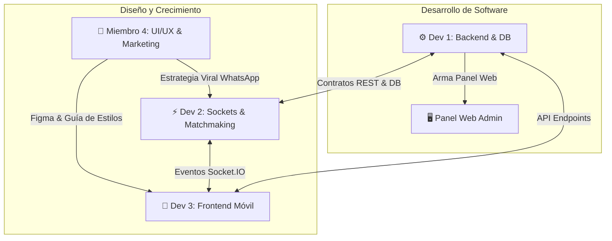

# 🏗️ ARQUITECTURA TÉCNICA Y GUÍA DE DESARROLLO DESACOPLADO
## Especificación de Ingeniería para MatchSport (Backend, App Móvil Jugadores & Web Admin)

> **Documento:** Guía Maestra de Ingeniería y Protocolo para Agentes de IA  
> **Versión:** 1.0.0 — Separación de Frontend, Backend, Tiempo Real y Seguridad  
> **Propósito:** Servir como especificación técnica definitiva para que un Agente de IA (o equipo de ingeniería) desarrolle, refactorice y escale el proyecto de forma desacoplada y profesional.

---

## 📑 ÍNDICE GENERAL

1. [Veredicto: ¿Es viable usar la base actual para desarrollar con un Agente IA?](#1-veredicto-es-viable-usar-la-base-actual-para-desarrollar-con-un-agente-ia)
2. [Estructura del Proyecto: Estrategia Monorepo Limpio](#2-estructura-del-proyecto-estrategia-monorepo-limpio)
3. [Arquitectura del Backend (API REST, Sockets & Capas)](#3-arquitectura-del-backend-api-rest-sockets--capas)
   - 3.1 Estructura Interna por Capas (Clean Architecture)
   - 3.2 Seguridad y Autenticación (JWT + PIN Bcrypt)
   - 3.3 Motor de Tiempo Real (Socket.IO + Redis Pub/Sub)
   - 3.4 Persistencia y Migración de Base de Datos (SQLite -> PostgreSQL)
   - 3.5 Estrategia de Caché y Alta Concurrencia (Redis)
4. [Arquitectura del Frontend 1: App Móvil para Jugadores (Capacitor)](#4-arquitectura-del-frontend-1-app-móvil-para-jugadores-capacitor)
5. [Arquitectura del Frontend 2: Panel Web para Administrador / Dueño](#5-arquitectura-del-frontend-2-panel-web-para-administrador--dueño)
6. [Contrato de Comunicación y Eventos de Tiempo Real](#6-contrato-de-comunicación-y-eventos-de-tiempo-real)
7. [Protocolo de Trabajo para el Agente de IA (Instrucciones de Ejecución)](#7-protocolo-de-trabajo-para-el-agente-de-ia-instrucciones-de-ejecución)
8. [Organización y Reparto del Equipo de Trabajo (3 Devs + 1 UI/UX & Marketing)](#8-organización-y-reparto-del-equipo-de-trabajo-3-devs--1-uiux--marketing)

---

## 1. VEREDICTO: ¿ES VIABLE USAR LA BASE ACTUAL PARA DESARROLLAR CON UN AGENTE IA?

**Sí, es 100% viable y recomendable.**

El prototipo actual no es una maqueta estática; tiene **la lógica más compleja del negocio ya resuelta y validada con tests**:
* El algoritmo matemático **Glicko-2** con RD y volatilidad.
* El cálculo geoespacial por **Haversine** y distritos de Lima.
* La **autenticación por PIN de 4 dígitos con hash `bcryptjs`**.
* El **período de gracia de 25 segundos** ante microcortes de red.
* El flujo de aceptación de **20 segundos estilo Dota 2**.

Al pasar de un prototipo monolítico a una **arquitectura desacoplada**, no se tira el código a la basura: **se reorganiza en paquetes especializados** para que el backend pueda escalar de forma autónoma y cada frontend (Móvil y Web) tenga su propio entorno de construcción optimizado.

---

## 2. ESTRUCTURA DEL PROYECTO: ESTRATEGIA MONOREPO LIMPIO

Para que un Agente de IA trabaje sin fricción, la mejor estrategia es un **Monorepo con npm workspaces**. Permite tener el Backend, la App Móvil y el Panel Web en repositorios desacoplados pero dentro del mismo proyecto, compartiendo tipos y constantes deportivas sin duplicar código:

```
MATCHSPORT_PLATFORM/
├── package.json                      # Orquestador raíz (npm workspaces)
│
├── apps/
│   ├── backend/                      # ⚙️ SERVICIO BACKEND (Node.js API + Sockets)
│   │   ├── src/
│   │   │   ├── config/               # Variables de entorno y DB config
│   │   │   ├── controllers/          # Controladores HTTP (Auth, Matches, Admin)
│   │   │   ├── middlewares/          # Auth JWT, Rate-limit, Roles, Validation
│   │   │   ├── models/               # Esquemas y Repositorios (PostgreSQL/Prisma)
│   │   │   ├── services/             # Lógica pura (Matchmaking, Glicko2, Lobbies)
│   │   │   ├── sockets/              # Handlers de Socket.IO por dominio
│   │   │   └── utils/                # Logger Winston, Haversine, helpers
│   │   ├── server.js                 # Punto de entrada HTTP y WebSocket
│   │   └── package.json
│   │
│   ├── player-mobile/                # 📱 APP MÓVIL DEL JUGADOR (Android / iOS)
│   │   ├── src/
│   │   │   ├── components/           # Radar, Cartas FUT, Salas, Modales
│   │   │   ├── services/             # socketClient.js, apiClient.js, pushNotifications.js
│   │   │   ├── stores/               # Estado global (Zustand o React Context)
│   │   │   ├── styles/               # CSS y animaciones móviles
│   │   │   └── App.jsx               # Flujo principal del deportista
│   │   ├── capacitor.config.json     # Configuración nativa Android/iOS
│   │   ├── android/                  # Proyecto nativo Android Studio
│   │   └── package.json
│   │
│   └── admin-web/                    # 🖥️ PANEL WEB SUPERADMIN & B2B (Desktop PC)
│       ├── src/
│       │   ├── components/           # Tablas de métricas, visor en vivo, moderación
│       │   ├── services/             # adminApiClient.js, adminSocketClient.js
│       │   ├── views/                # LiveActivity, Metrics, Users, Disputes, Sports
│       │   └── App.jsx               # Dashboard ejecutivo panorámico
│       └── package.json
│
└── packages/
    └── shared/                       # 📦 PAQUETE COMPARTIDO (Tipos y Constantes)
        ├── sportsConfig.js           # Catálogo de deportes y formatos (1v1, 5v5)
        ├── peruDistricts.json        # Catálogo de distritos de Lima y coordenadas
        └── socketEvents.js           # Diccionario estricto de eventos Socket.IO
```

---

## 3. ARQUITECTURA DEL BACKEND (API REST, SOCKETS & CAPAS)

### 3.1. Estructura Interna por Capas (Clean Architecture)
El backend debe seguir el principio de separación de responsabilidades:
* **Capa de Transporte (HTTP / Sockets):** Solo recibe peticiones, valida entradas y devuelve respuestas (códigos 200, 400, 401, 500). No contiene lógica de puntuación ni emparejamiento.
* **Capa de Servicios (Business Logic):** Aquí residen:
  * `MatchmakingService`: Procesa la cola, evalúa ratings Glicko y distancias.
  * `LobbyService`: Administra salas de convocatoria por PIN y cambios de equipo.
  * `RatingService`: Calcula variaciones de Glicko-2 tras el reporte de resultados.
* **Capa de Datos (Repository Pattern):** Consultas directas a la base de datos sin acoplar el código a un motor específico.

### 3.2. Seguridad y Autenticación
1. **Flujo de Acceso para Jugadores:**
   * El jugador ingresa `Nombre + PIN (4 dígitos)`.
   * El servidor valida el PIN con `bcryptjs.compareSync(pin, user.pinHash)`.
   * El servidor firma un **JSON Web Token (JWT)** con vigencia (ej. 30 días en móvil) que contiene `{ userId, role: 'player' }`.
   * El cliente móvil almacena el token en almacenamiento seguro (`Capacitor Preferences` o `localStorage`) y lo envía en el header `Authorization: Bearer <TOKEN>` y en el handshake de Socket.IO:
     ```javascript
     const socket = io('https://api.matchsport.pe', {
       auth: { token: 'Bearer eyJhbGciOi...' }
     });
     ```
2. **Flujo de Acceso para el SuperAdmin:**
   * Requiere `Email + Contraseña Segura + Rol 'admin'`.
   * Emite un JWT con claims administrativos `{ userId, role: 'admin' }`.
   * Todas las rutas `/api/admin/*` están protegidas por el middleware `requireAdminRole`.
3. **Protecciones Obligatorias:**
   * **Rate Limiting (`express-rate-limit`):** Máximo 10 intentos de PIN por minuto por IP para evitar ataques de fuerza bruta.
   * **Validación de Entradas (`Zod`):** Validación estricta del esquema de datos en cada endpoint antes de procesarlo.
   * **CORS estricto:** Permitir solo el dominio de la web admin y las aplicaciones de Capacitor (`capacitor://localhost`, `http://localhost`).

### 3.3. Motor de Tiempo Real (Socket.IO + Redis Pub/Sub)
* **Middleware de Autenticación de Socket:**
  ```javascript
  io.use((socket, next) => {
    const token = socket.handshake.auth.token;
    // Verificar JWT y vincular socket.userId de forma segura
    const decoded = verifyJwt(token);
    if (!decoded) return next(new Error('No autorizado'));
    socket.userId = decoded.userId;
    next();
  });
  ```
* **Manejo de Desconexión con Período de Gracia (25s):**
  * Si el socket se desconecta, se activa un temporizador de 25 segundos antes de expulsar al jugador de su sala o de la cola del radar. Si reconecta con un nuevo socket, se restaura el estado.
* **Escalado Horizontal con Redis Adapter:**
  * En producción, se activa `@socket.io/redis-adapter` para que múltiples servidores Node.js puedan emitir eventos a cualquier usuario conectado a cualquier máquina.

### 3.4. Persistencia y Migración de Base de Datos
* **Fase Actual (MVP):** SQLite compilado a WebAssembly (`sql.js`) con auto-guardado debounced a disco (`matchsport.db`).
* **Migración a Producción:** **PostgreSQL** mediante un ORM como **Prisma** o **Drizzle ORM**.
  * Esquema Relacional de Producción:
    * `users`: Identidad, PIN hasheado, rol, bio, foto, fecha de creación.
    * `user_profiles`: Rating Glicko (rating, rd, volatility), victorias, derrotas por deporte y formato.
    * `matches`: Partidos (deporte, formato, estado, marcador, duración).
    * `match_reports`: Reportes de ambos capitanes para validación de consenso o disputa.
    * `reviews`: Calificaciones de Fair Play y atributos coleccionables.
    * `lobbies`: Salas activas y su lista de convocados.

---

## 4. ARQUITECTURA DEL FRONTEND 1: APP MÓVIL PARA JUGADORES (CAPACITOR)

* **Stack:** React 18, Vite, Capacitor 8, Tailwind CSS / Vanilla CSS modular.
* **Objetivo:** Experiencia nativa fluida a 60 FPS, sin recargas de página y con respuesta táctil instantánea.

### 4.1. Principios de UX/UI Móvil de Éxito (Estilo TikTok / Instagram / Uber)

Para que una aplicación de consumo sea masiva y adictiva, debe seguir tres leyes universales de diseño móvil:

1. **La "Regla de la Zona del Pulgar" (The Thumb Zone):**
   * El 75% de las personas usan el teléfono con una sola mano y operan la pantalla exclusivamente con el dedo pulgar.
   * Los botones críticos (ej. *"Buscar Rival"*, *"Unirme a la Sala"*, *"Aceptar Partido"*) deben situarse en el **tercio inferior de la pantalla**, donde el pulgar llega de forma natural y sin esfuerzo.
   * La parte superior se reserva solo para información de lectura (marcadores, avatar o título).

2. **La Ley de Hick (Eliminación Radical de Botones Innecesarios):**
   * *"A mayor cantidad de opciones en pantalla, mayor tiempo y frustración le toma al usuario decidir"*.
   * Cero menús hamburguesa interminables o laberintos de ajustes.
   * Cada pantalla debe tener **un único botón de acción principal (Primary CTA)** grande, vibrante y evidente.

3. **Feedback Háptico y Micro-interacciones:**
   * La app debe sentirse "viva". Cuando el radar encuentra rival o el jugador pulsa *"Aceptar"*, el teléfono debe emitir una **micro-vibración háptica** (`@capacitor/haptics`) acompañada de una animación fluida.

---

### 4.2. La Barra de Navegación Inferior (Bottom Tab Bar de 4 Iconos)

Las guías oficiales de **Apple (Human Interface Guidelines)** y **Google (Material Design 3)** establecen que la barra inferior debe tener **entre 3 y 5 iconos máximo** (siendo 4 el número de oro para no saturar la vista):

```
┌──────────────────────────────────────────────────────────────────┐
│                                                                  │
│                     PANTALLA ACTIVA                              │
│                                                                  │
├──────────────┬──────────────┬──────────────┬─────────────────────┤
│      🧭      │      🏟️      │      🏆      │          👤         │
│    JUGAR     │    SALAS     │   RANKING    │       PERFIL        │
│   (Radar)    │ (Lobbies)    │ (Comunidad)  │    (Carta FUT)      │
└──────────────┴──────────────┴──────────────┴─────────────────────┘
```

| # | Icono y Nombre | Función Principal en la App |
| :-: | :--- | :--- |
| **1** | 🧭 **JUGAR (Radar)** | **Pantalla de inicio / Core:** Selector del deporte favorito, mapa de distancia y el gran botón interactivo *"Buscar Partido"*. |
| **2** | 🏟️ **SALAS (Lobbies)** | **Convocatorias:** Ver partidos que necesitan jugadores en tu distrito, crear una sala privada para invitar amigos por WhatsApp o ingresar con PIN. |
| **3** | 🏆 **RANKINGS** | **Comunidad y Estatus:** Tabla de posiciones distrital (Top goleadores, mejores valorados) y cartas TOTW destacadas de la semana. |
| **4** | 👤 **PERFIL** | **Identidad del Jugador:** Tu Carta Coleccionable FUT con los 6 atributos, historial de partidos jugados, porcentaje de Fair Play y ajustes. |

---

### 4.3. Módulos Core del Jugador (Vistas Optimizadas)
1. `AuthModal`: Acceso en 2 taps con Nombre + PIN (cero formularios pesados).
2. `RadarScreen`: Brújula visual de búsqueda con animación de radar.
3. `MatchAcceptModal`: Modal de aceptación de 20s estilo Dota 2 con barra de cuenta regresiva.
4. `LobbyRoomModal`: Gestión de convocatorias con botón directo para compartir enlace en WhatsApp.
5. `PlayerCardFUT`: Tarjeta deportiva dorada/plata con atributos dinámicos según el deporte.
6. `ChatRoom`: Chat en vivo durante el partido con marcador en tiempo real.

### 4.4. Plugins Nativos de Capacitor
* `@capacitor/geolocation`: Para centrar el radar en el distrito actual con 1 tap.
* `@capacitor/push-notifications`: Notificaciones en segundo plano cuando se completa un partido.
* `@capacitor/haptics`: Vibración al aceptar partido o confirmar marcador.
  * `@capacitor/haptics`: Vibración táctil al aceptar partido o recibir un gol/chat.

---

## 5. ARQUITECTURA DEL FRONTEND 2: PANEL WEB PARA ADMINISTRADOR (DESKTOP)

* **Stack:** React 18, Vite, Lucide Icons, Gráficos (Recharts / Chart.js).
* **Objetivo:** Consola panorámica de alta densidad de información para pantallas de 1080p o superiores.
* **Módulos Core:**
  1. **Live Monitor:** Tarjetas en tiempo real con sockets activos, partidos en curso y colas de radar.
  2. **Audit Directory:** Tabla de usuarios con búsqueda rápida, filtros por distrito, botón de baneo temporal/definitivo y verificación manual de DNI.
  3. **Dispute Resolution Room:** Pantalla dividida donde el administrador ve lo que reportó el Capitán A vs lo que reportó el Capitán B y asigna el resultado definitivo.
  4. **Sports & Format Manager:** Interruptores para activar/desactivar deportes o formatos sobre la marcha.
  5. **Questionnaire Editor:** Formulario para calibrar las preguntas de nivelación y sus puntajes base.

---

## 6. CONTRATO DE COMUNICACIÓN Y EVENTOS DE TIEMPO REAL

Para garantizar que el Backend y ambos Frontends hablen exactamente el mismo idioma sin errores de tipeo, todos los eventos deben importarse desde el paquete compartido (`packages/shared/socketEvents.js`):

```javascript
export const SOCKET_EVENTS = {
  // Conexión y Presencia
  CLIENT_CONNECT: 'userConnected',
  SERVER_ONLINE_USERS: 'onlineUsersUpdate',

  // Matchmaking (Radar)
  CLIENT_START_QUEUE: 'startSearch',
  CLIENT_CANCEL_QUEUE: 'cancelSearch',
  SERVER_QUEUE_STATUS: 'queueStatus',
  SERVER_MATCH_PROMPT: 'matchPromptAcceptance', // Ventana de 20 segundos
  CLIENT_ACCEPT_MATCH: 'acceptMatch',
  CLIENT_DECLINE_MATCH: 'declineMatch',
  SERVER_MATCH_FOUND: 'matchFound',
  SERVER_ACCEPTANCE_FAILED: 'matchAcceptanceFailed',

  // Salas de Convocatoria (Lobbies)
  CLIENT_CREATE_LOBBY: 'createLobby',
  CLIENT_JOIN_LOBBY: 'joinLobby',
  CLIENT_LEAVE_LOBBY: 'leaveLobby',
  CLIENT_SWITCH_TEAM: 'switchLobbyTeam',
  CLIENT_TOGGLE_READY: 'toggleLobbyReady',
  SERVER_LOBBY_UPDATED: 'lobbyUpdated',
  SERVER_LOBBY_RESTORED: 'lobbyRestored',

  // Partidos en Cancha y Chat
  CLIENT_SEND_CHAT: 'sendChatMessage',
  SERVER_NEW_CHAT: 'newChatMessage',
  CLIENT_REPORT_RESULT: 'reportResult',
  SERVER_MATCH_DISPUTED: 'matchDisputed',
  SERVER_MATCH_FINISHED: 'matchFinished'
};
```

---

## 7. PROTOCOLO DE TRABAJO PARA EL AGENTE DE IA (INSTRUCCIONES DE EJECUCIÓN)

Cuando un Agente de IA reciba instrucciones para construir, refactorizar o agregar funciones a este proyecto, debe seguir rigurosamente este **flujo de 5 pasos**:

```
[ 1. Definir Contrato ] ──► [ 2. Test Unitario ] ──► [ 3. Backend ] ──► [ 4. Frontend ] ──► [ 5. Build E2E ]
Definir tipos y rutas      Escribir prueba que falle Implementar lógica Integrar componente  Validar compilación
```

1. **Paso 1 (Contratos Primero):**
   * Antes de tocar código visual, define la ruta REST en el Backend o el evento en `socketEvents.js`.
2. **Paso 2 (Prueba Automatizada de Backend):**
   * Crea o ejecuta un script en `scripts/test_*.js` que valide la respuesta del servidor antes de conectar la interfaz.
3. **Paso 3 (Implementación Backend):**
   * Implementa la lógica en la capa de servicios (`services/`), nunca dentro de un `server.js` monolítico.
4. **Paso 4 (Integración en Frontend):**
   * Si la función es para el jugador (móvil), edita en `player-mobile/`.
   * Si la función es de control, auditoría o métricas, edita en `admin-web/`.
5. **Paso 5 (Validación de Compilación Cero Errores):**
   * Ejecutar siempre `npm run build` en cada app para verificar que no queden errores de sintaxis, variables no declaradas o estilos rotos.

---

## 8. ORGANIZACIÓN Y REPARTO DEL EQUIPO DE TRABAJO (3 DEVS + 1 UI/UX & MARKETING)

Para maximizar la velocidad de desarrollo y evitar que los integrantes se pisen el código, el trabajo se distribuye de forma especializada según las habilidades de cada perfil:



### 8.1. Matriz de Roles y Responsabilidades

#### 🎨 Miembro 4: Profesional de UI/UX y Marketing (Líder de Producto & Crecimiento)
* **Frente de Diseño UI/UX (Figma):**
  1. Diseñar el **Design System** oficial (colores oscuros deportivos, tipografía moderna, botones táctiles grandes).
  2. Diseñar en Figma las pantallas de la **App Móvil de Jugadores** siguiendo la **Barra de 4 Iconos** (Radar, Salas, Rankings, Perfil) y la **Zona del Pulgar**.
  3. Diseñar las **Cartas Coleccionables FUT** por deporte (bronce, plata, oro y edición especial TOTW).
* **Frente de Marketing & Crecimiento:**
  1. **Viralidad por WhatsApp:** Diseñar la imagen y el texto de invitación directa que se envía al compartir una sala.
  2. **Alianza Piloto con Canchas:** Cerrar acuerdo con 2 complejos deportivos locales para colocar afiches con código QR y usar la app en sus horarios vacíos.

#### ⚙️ Dev 1: Backend, Base de Datos & Seguridad (Backend Lead)
* **Responsabilidad Principal:** La solidez del servidor, persistencia y seguridad de la información.
* **Tareas Clave:**
  1. Estructuración de la base de datos (SQLite actual y migración a **PostgreSQL** con Prisma/Drizzle).
  2. Sistema de autenticación por **Nombre + PIN de 4 dígitos** con hash `bcryptjs` y emisión de tokens **JWT**.
  3. Implementación de **Rate-Limiting**, validaciones de entrada (`Zod`) y permisos de rol (`admin` vs `player`).
  4. Desarrollo del **Panel Web SuperAdmin** (desktop) para monitorear métricas, salas en vivo y resolver disputas.

#### ⚡ Dev 2: Tiempo Real, Algoritmos & Concurrencia (Real-Time Engineer)
* **Responsabilidad Principal:** La magia en vivo de emparejamientos y comunicación instantánea.
* **Tareas Clave:**
  1. Arquitectura de eventos en **Socket.IO** y estandarización del diccionario `socketEvents.js`.
  2. Mantenimiento y optimización del motor **Glicko-2** y cálculo de distancias por **Haversine**.
  3. Lógica de la **Expansión Dinámica de Ventana** (+30 pts cada 5s) y el **Modal de Aceptación de 20s**.
  4. Garantizar la **Reconexión Resiliente (Grace Period de 25s)** ante microcortes de red.
  5. Configuración de **Redis Pub/Sub** para soporte de miles de conexiones en simultáneo.

#### 📱 Dev 3: Frontend Móvil del Jugador (Mobile Lead — React + Capacitor)
* **Responsabilidad Principal:** La experiencia táctil del jugador en su teléfono celular a 60 FPS.
* **Tareas Clave:**
  1. Maquetación exacta en React + Tailwind/CSS a partir de los diseños entregados en Figma.
  2. Implementación de la **Barra Inferior de 4 Iconos** (Jugar, Salas, Rankings, Perfil) y navegación suave.
  3. Conexión de los eventos de Socket.IO que expone Dev 2 (animación del radar, chat en vivo y modales).
  4. Integración de plugins nativos de Capacitor: **Vibración háptica** (`@capacitor/haptics`), **GPS** y **Push Notifications**.

---

### 8.2. Cronograma de Trabajo Ágil (Sprint de 3 Semanas)

| Semana | Miembro 4 (UI/UX & Mkt) | Dev 1 (Backend & DB) | Dev 2 (Tiempo Real) | Dev 3 (Mobile Lead) |
| :---: | :--- | :--- | :--- | :--- |
| **Semana 1** | Entrega prototipo en Figma de los 4 tabs y la carta FUT. Diseña afiche de canchas. | Define el esquema de DB y las rutas de API REST junto con Dev 2. | Estandariza `socketEvents.js` y refina el motor Glicko-2. | Prepara la estructura de navegación en React y configura Capacitor Android. |
| **Semana 2** | Redacta copies de WhatsApp y contacta las 2 canchas piloto. | Implementa Auth por PIN + JWT y endpoints de partidos y admin. | Conecta el flujo de Salas (Lobbies) y el Modal de 20s en Socket.IO. | Maqueta las pantallas de Salas y Radar con base en el Figma. |
| **Semana 3** | Prueba de usabilidad con 5 amigos en una cancha real. | Monta el Panel Web Admin con métricas en vivo. | Ajusta la reconexión resiliente y el reporte de resultados. | Conecta la app móvil completa a la API y sockets. |

---
*Fin de la Especificación de Arquitectura Desacoplada. Documento listo para ejecución asistida por Agentes de IA.*
